# LightMap

> Shade by day. Light by night.

**Live demo:** [Interactive time slider](https://juhongpark.github.io/lightmap/prototype_timeslider.html) — scrub through any date and time. Shadows sweep with the sun, basemap fades from dark to light as the sun rises, streetlights switch on at dusk, and violent-crime pins appear on top of the night layer.

An interactive web map that shows where shade falls during the day and where light shines at night in Boston and Cambridge, MA. Uses real-time sun position, building geometry, streetlight locations, and tree canopy data.

Built by **Juhong Park** (System Design and Management, MIT) as a term project for [**MIT 1.001: Engineering Computation and Data Science**](https://student.mit.edu/catalog/search.cgi?search=1.001) (Spring 2026), taught by [Abel Sanchez](https://abel.mit.edu/) and [John R. Williams](https://johntango.github.io/). Course website: [onexi.org](https://onexi.org).

## Preview

| Day (Shadow Map) | Night (Brightness Map) |
| --- | --- |
| 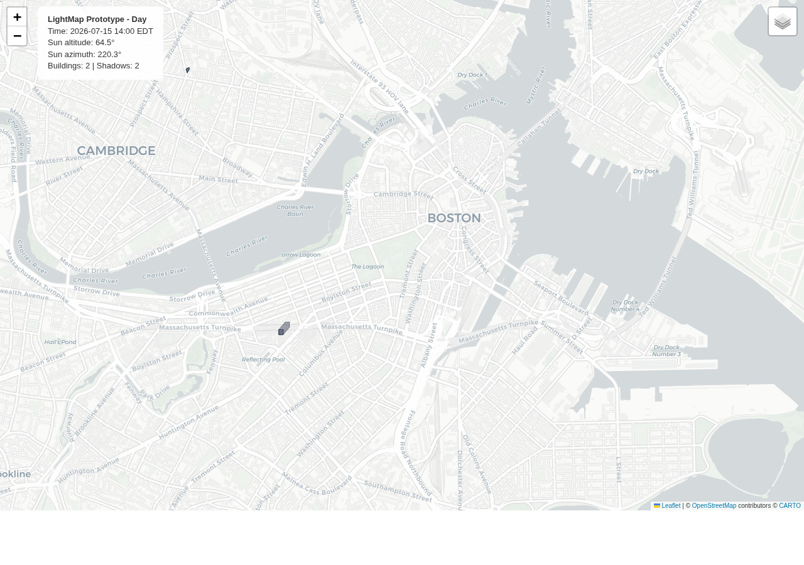 | 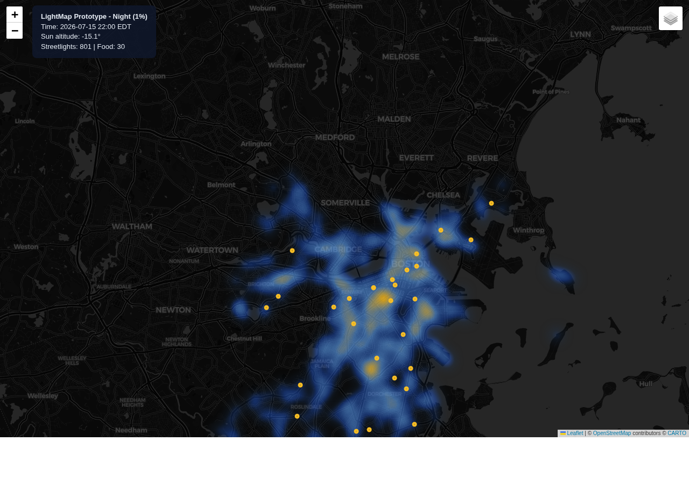 |

123K buildings with shadows and ~59K tree-canopy crowns (day). 80K streetlights as a bright-yellow heatmap with ~760 time-gated OSM venue dots and ~830 violent-crime diamond pins (night).

### How It Works

The shadow engine computes sun position (pvlib) and projects each building footprint along the opposite azimuth. The brightness map renders streetlight density as a heatmap. Both scale from a single building to the full dataset:

| Data&nbsp;Ratio | Day | Night |
| :--: | --- | --- |
| 1 each | 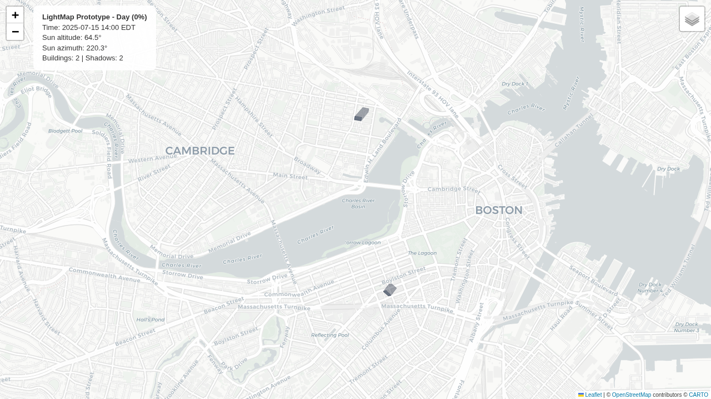 | 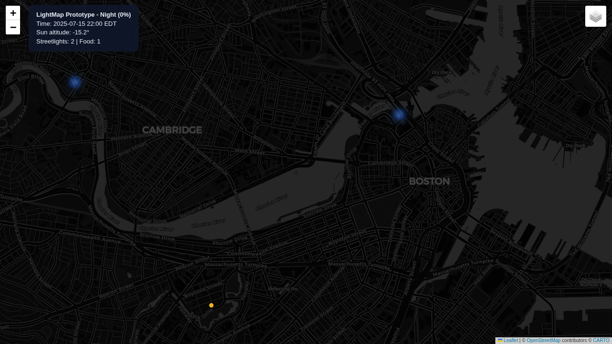 |
| 1% | 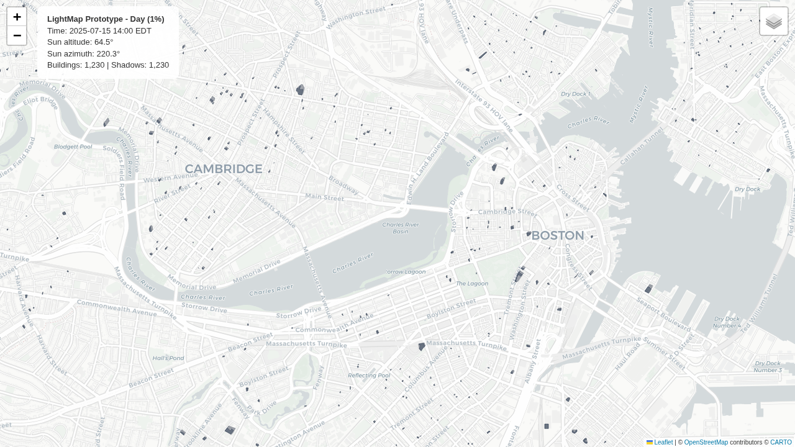 | 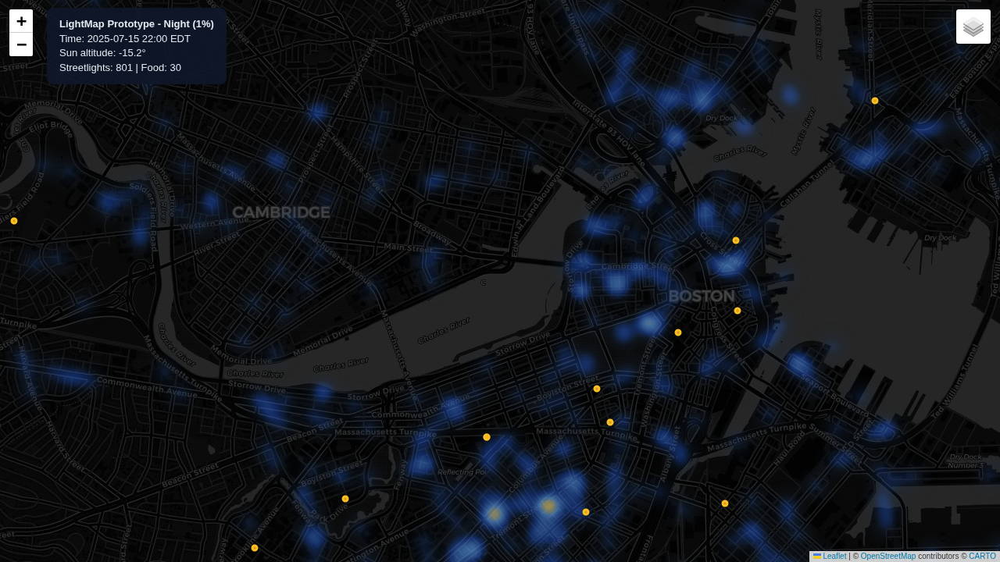 |
| 10% | 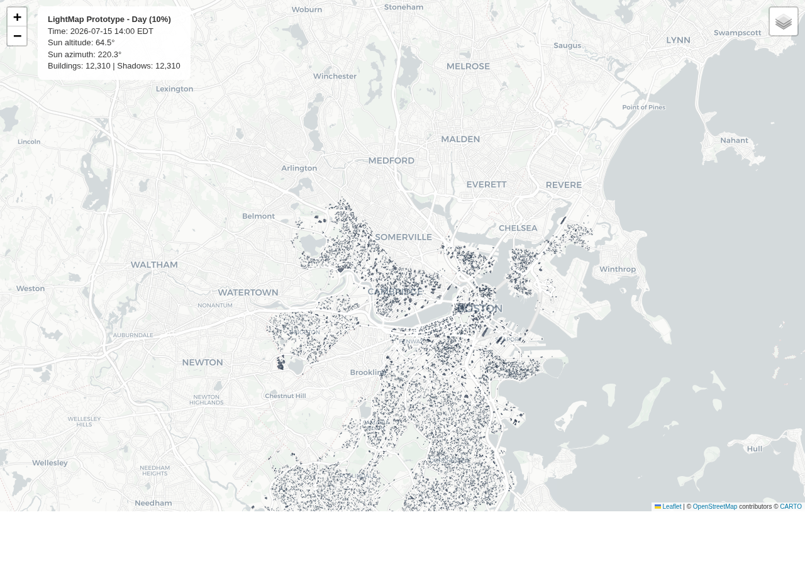 | 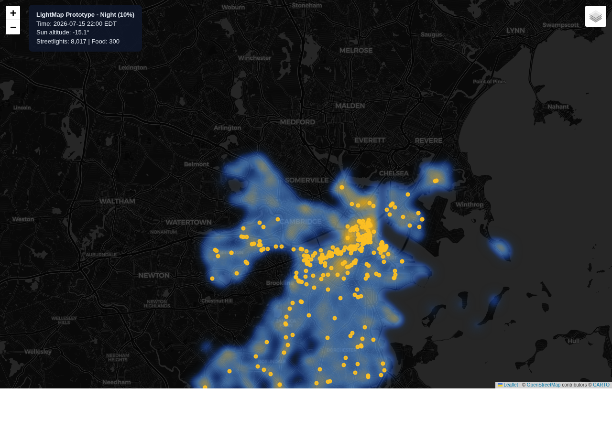 |
| 50% | 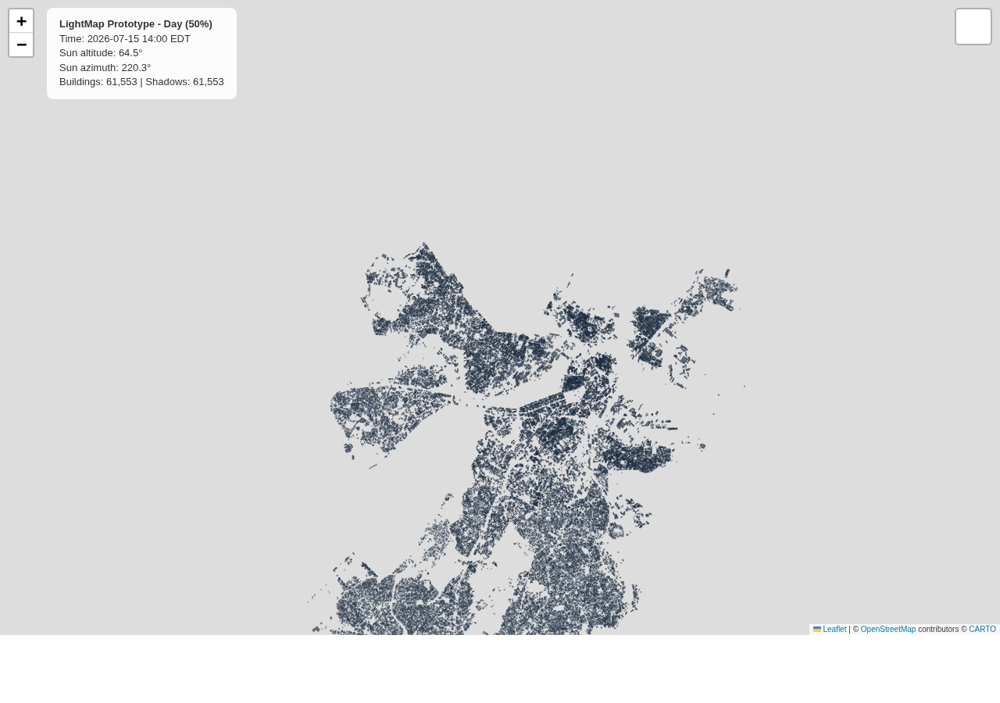 | 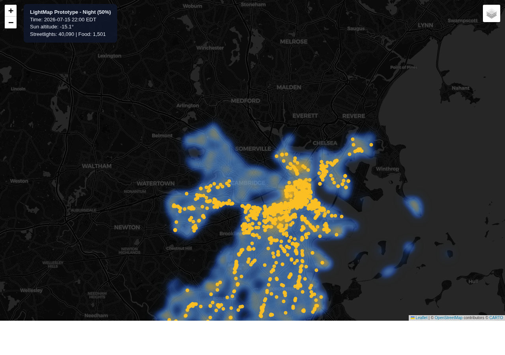 |
| 100% | 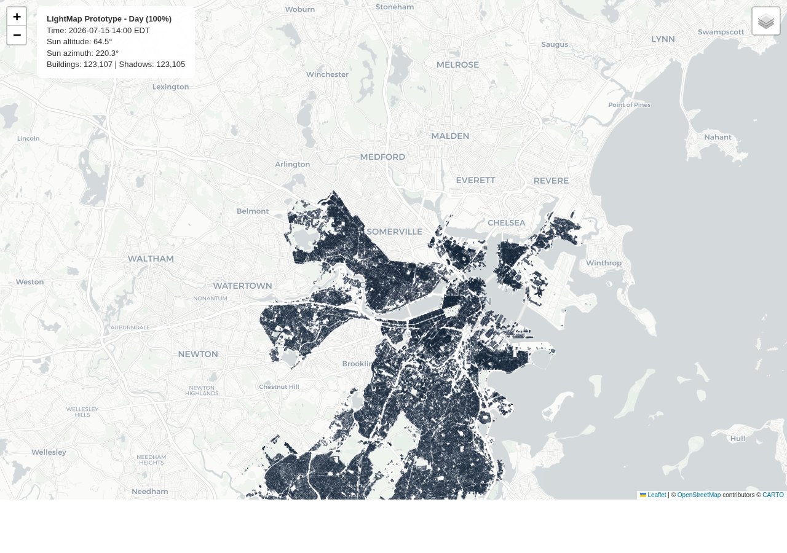 | 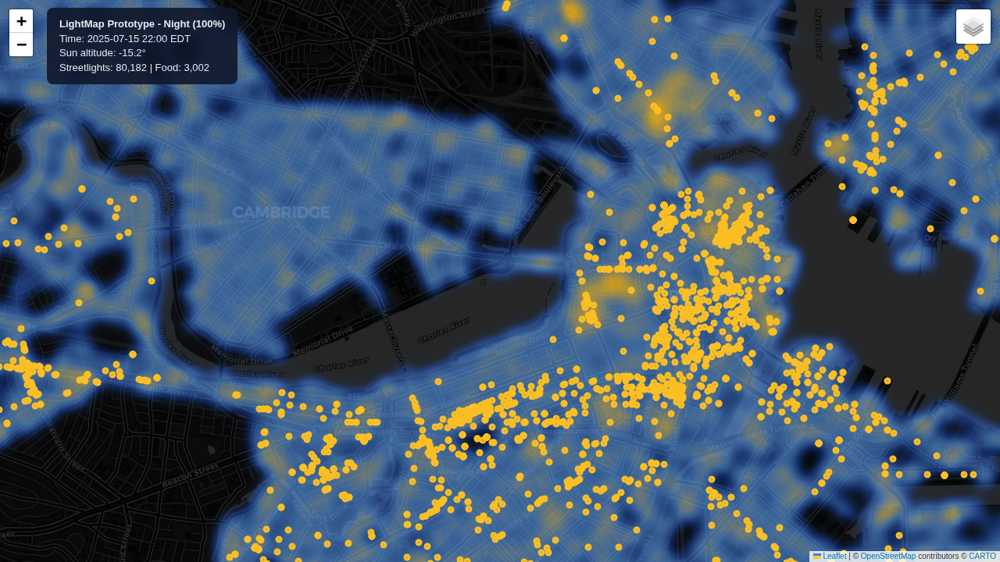 |

## Tech Stack

| Layer | Technologies |
| --- | --- |
| Shadow engine | pvlib (sun position), Shapely (geometry projection) |
| Map generation | folium (Leaflet-based interactive maps) |
| Data pipeline | httpx, pandas, csv |
| Base tiles | CARTO Positron (day), CARTO Dark Matter (night) |

## Data Sources

| Dataset | Records | Source | Used for |
| --- | --- | --- | --- |
| Boston buildings (with height) | 105K with height | [BPDA](https://data.boston.gov/dataset/boston-buildings-with-roof-breaks) (2010 survey) | Shadow projection |
| Cambridge buildings (with height) | 18K | [Cambridge GIS](https://github.com/cambridgegis/cambridgegis_data) (2018 data) | Shadow projection |
| Boston streetlights | 74K | [data.boston.gov CKAN](https://data.boston.gov/dataset/streetlight-locations) | Brightness heatmap |
| Cambridge streetlights | 6K | [Cambridge GIS](https://github.com/cambridgegis/cambridgegis_data_infra) | Brightness heatmap |
| Boston food establishments (active licenses) | 3K | [data.boston.gov CKAN](https://data.boston.gov/dataset/active-food-establishment-licenses) | Standalone night map markers |
| **OSM amenity POIs (with `opening_hours`)** | 760 inside viewport | [OpenStreetMap via Overpass API](https://overpass-turbo.eu/) | Time-slider time-aware venue markers |
| **Tree canopy (Cambridge 2018 + Boston 2019-2024)** | ~59K per-crown polygons inside viewport | [Cambridge GIS](https://github.com/cambridgegis/cambridgegis_data_environmental) + [Boston BPDA Tree Canopy Change Assessment](https://data.boston.gov/dataset/tree-canopy-change-assessment) | Tree shade in the time-slider shadow engine. Each polygon is treated as a 10 m canopy and casts a shadow along the same sun angle as buildings. Boston LiDAR crowns are streamed in-place from a 1 GB ZIP via `ogr2ogr`, simplified to ~2 m, and height-clamped to 1.5-40 m. The merge step is intentionally skipped (per-crown) so the canopy boundary tracks the actual tree footprint instead of the buffer-union's inflated shade strip. |
| **Weather + UV (Open-Meteo)** | 1 daily record per slider date | [Open-Meteo API](https://open-meteo.com/) | Info panel temperature range + max UV for the slider's currently selected date. Free and no auth. Fetched live from the browser: forecast API for today-to-future-16-days, archive API for historical dates. |
| **Boston crime incidents (last 2 years, night hours)** | ~19K inside viewport | [data.boston.gov CKAN](https://data.boston.gov/dataset/crime-incident-reports-august-2015-to-date-source-new-system) | Night-only safety heatmap. Aggregated, not live. Filtered to hours 18-05 so the map shows the pattern people actually encounter when walking home. |
| **Boston crime incidents -- violent subset (last 2 years)** | ~830 inside viewport | Filtered from the crime dataset above | Red diamond pins on the night layer. Murder, aggravated assault, robbery, sexual offenses, firearm and weapon incidents. Click to see the offense description. |
| **OpenStreetMap water polygons** | 175 features inside viewport | [OpenStreetMap via Overpass API](https://overpass-turbo.eu/) | Mask used by `scripts/clip_trees_by_water.py` so the tree-canopy layer never extends over the Charles, Fort Point Channel, or the harbor. |

### Time-slider data scope

The interactive time slider embeds only the Boston + Cambridge core (a bbox roughly covering MIT, central Cambridge, Back Bay, and downtown Boston). Data outside this bbox is not loaded. The shipped HTML is ~27 MB at 100% scale — the bulk comes from the per-crown tree-canopy polygons, which trade some file size for accurate canopy boundaries. See `src/render/strategies.py` `INITIAL_BBOX` for the exact coordinates.

### How OpenStreetMap powers the venue time-gating

Boston's public licensing dataset does not publish business operating hours — it only lists active licenses. To show which venues are actually open at a given time, the time-slider pulls amenity POIs (restaurant, bar, cafe, fast_food, pub, nightclub) from **OpenStreetMap** via the free, no-auth Overpass API and keeps only those carrying an `opening_hours` tag (about 50% of POIs in the target area). The browser parses that tag with [`opening_hours.js`](https://openingh.openstreetmap.de/) and shows each marker only when the slider's (date, time) is inside the venue's advertised hours.

**Snapshot caveat.** The OSM data is a single snapshot fetched at build time, not a live feed. It encodes the **current** advertised weekly pattern for each venue. When you scrub the slider to a past date, the weekday-pattern logic still applies correctly (Monday-at-08:00 a cafe whose tag is "Mo-Fr 07:00-15:00" shows open), but **specific historical events are not reflected**. For example:

- A restaurant that closed permanently last year is gone from the snapshot. It will not appear even if you pick a date when it was actually open.
- A venue that changed its hours in 2024 will show its post-2024 hours for every date, including dates before the change.
- Historical public-holiday closures in specific years are not captured unless the tag literally encodes them (rare in practice).

Rerun `scripts/download_osm_pois.py` to refresh the snapshot.

See [planning/data-catalog.md](planning/data-catalog.md) for the full data catalog.

## Getting Started

### Prerequisites

- Python 3.12 or newer
- About 300 MB of disk space for the raw datasets
- Optional but recommended for 100% scale runs: Docker, for the PostGIS container

### 1. Clone and set up the Python environment

```
git clone https://github.com/JuhongPark/lightmap.git
cd lightmap
python3 -m venv .venv
.venv/bin/pip install -r requirements.txt
```

### 2. Download the raw datasets

Every dataset is fetched from public Boston and Cambridge APIs. The script writes into `data/`, which is gitignored so nothing ever leaks back into the repo.

```
.venv/bin/python scripts/download_data.py
```

This downloads:

| File | Size | Source |
| --- | --- | --- |
| `data/buildings/boston_buildings.geojson` | 147 MB | BPDA |
| `data/cambridge/buildings/buildings.geojson` | 19 MB | Cambridge GIS |
| `data/streetlights/streetlights.csv` | 2.2 MB | data.boston.gov CKAN |
| `data/cambridge/streetlights/streetlights.geojson` | 2.7 MB | Cambridge GIS |
| `data/safety/food_establishments.csv` | 180 KB | data.boston.gov CKAN |

The time-slider adds four more datasets. Pull them with separate scripts so the external APIs are hit only when needed:

```
.venv/bin/python scripts/download_osm_pois.py
.venv/bin/python scripts/download_trees.py
.venv/bin/python scripts/download_safety.py
.venv/bin/python scripts/download_water.py
.venv/bin/python scripts/clip_trees_by_water.py
```

| File | Size | Source |
| --- | --- | --- |
| `data/osm/pois.geojson` | ~150 KB | OpenStreetMap via Overpass API |
| `data/trees/trees.geojson` | ~14 MB (Boston + Cambridge, per-crown) | Cambridge GIS TopoJSON + Boston BPDA TreeTops2024 (streamed from a 1 GB ZIP via ogr2ogr, simplified to ~2 m tolerance) |
| `data/water/water.geojson` | ~350 KB | OpenStreetMap via Overpass API (`natural=water`, `waterway=riverbank|river`) |
| `data/safety/crime.geojson` | ~3 MB | Boston data.boston.gov CKAN (last 2 years, night hours, INITIAL_BBOX filtered) |
| `data/safety/crashes.geojson` | ~220 KB | Boston data.boston.gov CKAN (last 2 years, INITIAL_BBOX filtered). Still downloaded but no longer rendered — the night layer now uses the violent-crime subset of `crime.geojson` instead. |

`clip_trees_by_water.py` is a post-processing step that subtracts the water union from `trees.geojson` in place. Run it after every `download_trees.py --force` so the canopy layer never floats over water.

### 3. Pre-process buildings into SQLite

Converts the raw GeoJSON into a compact `data/buildings.db` with WKB blobs and a spatial bounding box index. Speeds up every subsequent run.

```
.venv/bin/python scripts/preprocess_buildings.py
```

### 4. Build the time-slider

The time-slider is the single production artifact. Build it with:

```
.venv/bin/python src/prototype.py --time-slider --out prototype_timeslider.html --scale 100
```

Opens `docs/prototype_timeslider.html` in your browser. During the day, shadows (buildings + per-crown tree canopy) move with the sun. After sunset the basemap fades dark, the streetlight heatmap switches on as a bright-yellow glow, OSM venues turn on one by one based on their real `opening_hours` tag, and violent-crime red-diamond pins appear on top. Weather and UV for the selected date are fetched live from Open-Meteo. Auto-play advances one slot per second.

Available flags:

| Flag | Effect |
| --- | --- |
| `--time-slider` | Build the interactive time-slider HTML. This is the only supported output. |
| `--scale N` | Percent of data to render. Valid values: 0, 1, 10, 50, 100. Default 1. Use 100 for the shipping build. |
| `--out NAME` | Output filename under `docs/`. Default `prototype.html`, so always pass `--out prototype_timeslider.html` for the time-slider. |
| `--time "YYYY-MM-DD HH:MM"` | Starting timestamp the slider opens at. |

### 5. Run tests

```
PYTHONPATH=src .venv/bin/python -m unittest discover tests
```

## Running at full 100% scale

The 100% scale run processes 123K buildings. Rendering it in pure Python works but takes around 15-25 seconds. A PostGIS backend brings that down to well under 10 seconds by running shadow projection as a parallel SQL query.

### 1. Start the PostGIS container

Requires Docker.

```
docker run -d --name lightmap-postgis -e POSTGRES_PASSWORD=lightmap -e POSTGRES_USER=lightmap -e POSTGRES_DB=lightmap -p 5432:5432 -v lightmap_pgdata:/var/lib/postgresql/data postgis/postgis:16-3.4
```

Stop later with `docker stop lightmap-postgis`. Restart with `docker start lightmap-postgis`.

### 2. Load the buildings into PostGIS

Creates the schema, inserts 123K buildings, builds a GiST spatial index, and enables 8 parallel workers on the buildings table.

```
.venv/bin/python scripts/preprocess_postgis.py
```

### 3. Build the time-slider at 100% scale

```
.venv/bin/python src/prototype.py --time-slider --out prototype_timeslider.html --scale 100
```

The code automatically detects the PostGIS container and uses it for the 100% path. Set the environment variable `LIGHTMAP_NO_POSTGIS=1` to force the pure Python fallback.

## Benchmarking

Measures each stage of the shadow pipeline at 100% scale, best-of-5 runs.

```
.venv/bin/python scripts/benchmark.py
```

See [planning/optimization-plan.md](planning/optimization-plan.md) for the full v1 through v7 optimization history and bottleneck analysis.

## Documentation

- [Project Description](planning/project.md) -- Shipped features, architecture, data sources, and as-mitigated risks.
- [Data Catalog](planning/data-catalog.md) -- Every dataset researched. Labels which entries are shipped vs downloaded-but-unused vs researched-only.
- [Technology Research](planning/tech-research.md) -- Shipped tech stack, design decisions, and competitor analysis. Notes why FastAPI + MapLibre were deferred.
- [Prototype Plan](planning/prototype-plan.md) -- Historical roadmap for the 1-each through 100% scale prototype.
- [Scale-Up Plan](planning/scaleup-plan.md) -- Per-stage targets and verification for the 1% through 100% scale-up.
- [Time Slider Plan](planning/time-slider-plan.md) -- Phase 1 MVP that shipped. Phase 2 (full client-side shadow compute) left as future work.
- [Extensions Plan](planning/extensions-plan.md) -- Tree canopy, weather, and safety-overlay rollout with per-phase outcomes.
- [Optimization Plan](planning/optimization-plan.md) -- Step-by-step day pipeline optimization from 102s to roughly 12s of compute.
- [Render Optimization Plan](planning/render-optimization-plan.md) -- r0 through r13 browser-side render strategies, from inline SVG that never loads to PNG-raster-primary with merged shadows.
- [Deploy Size Trim Plan](planning/deploy-size-trim-plan.md) -- Coordinate precision trim, bucket merge, raster-primary rendering experiments.
- [Bench Protocol](planning/bench-protocol.md) -- Checklist and red flags for producing trustworthy bench numbers.
- [Project TODOs](planning/TODO.md) -- Recently completed items and open follow-ups.
- [Course Information](planning/course.md) -- MIT 1.001 course details and grading rubric.

## License

[MIT](LICENSE)
